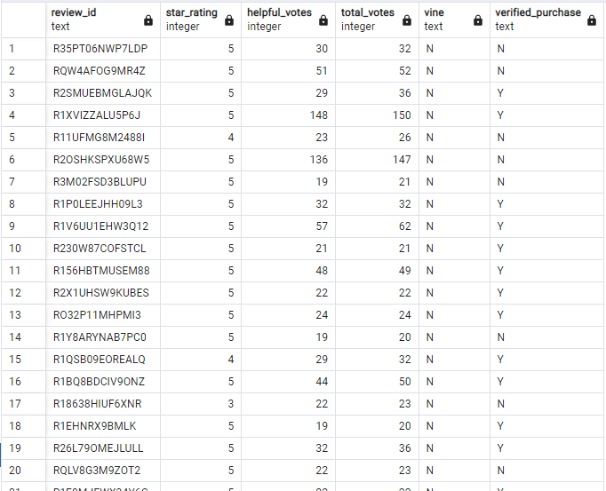
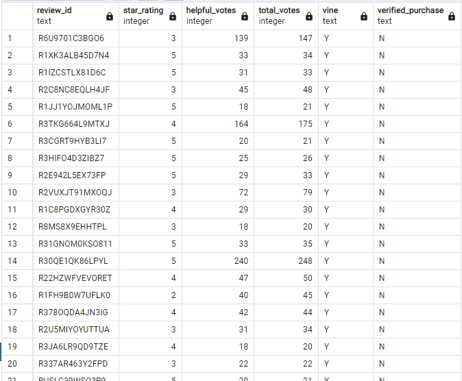

# Amazon Vine Analysis - Module 17 Challenge
Chapel Hill - Data Science Bootcamp

## Overview of Project
For Module 17, Amazon Web Services, pgAdmin's PostgreSQL, and Python in Google Colab were used to analyze Amazon reviews written by members of the (paid) Amazon Vine program. The dataset used in this exercise was the [apparel dataset](https://s3.amazonaws.com/amazon-reviews-pds/tsv/amazon_reviews_us_Apparel_v1_00.tsv.gz). 

## Method & Results
### Perform ETL on Amazon Product Reviews
Using Google Colab, a Spark session was established and connected with Java and PostgreSQL. After loading in the dataset, it was separated into four separate dataframes: `customers_df`, `products_df`, `review_id_df`, and `vine_df`. The dataframes were then transferred to PostgreSQL through the use of an AWS RDS instance and added to their respective tables. The link to the RDS instance and the password have been removed for security.

### Determine Bias of Vine Reviews
To determine the presence of bias or lack thereof, SQL queries were run on the `vine_table`, comparing how many 5-star reviews were paid versus unpaid. Four tables were created for our calculations:

  
Table 1: where total_votes≥20

  
  
  

  
Table 2: where helpful_votes/total_votes≥50%

  
  
  

  
Table 3: where vine='Y' (the review <b>was</b> part of the Vine program (paid))

  
  
  

  
Table 4: where vine='N' (the review was <b>not</b> part of the Vine program (unpaid))

  
  
  

Using these tables, three questions regarding paid-review bias were answered:
- How many Vine reviews and non-Vine reviews were there?
    

      
Vine reviews: 33

  
      
  
    

    

      
Non-Vine reviews: 45,388

  
      
  
    

- How many Vine reviews were 5 stars? How many non-Vine reviews were 5 stars?
    

      
5-star Vine reviews: 15

  
      
  
    

    

      
5-star non-Vine reviews: 23,733

  
      
  
    

- What percentage of Vine reviews were 5 stars? What percentage of non-Vine reviews were 5 stars?
    

      
Percent 5-star Vine reviews: 45.45%

  
      
  
    

    

      
Percent 5-star non-Vine reviews: 52.29%

  
      
  
    

## Summary
Given the results of the current dataset, it cannot necessarily be said that the Vine review program leads to biased product reviews. After filtering the data to only include products with greater than 20 total reviews, and where the ratio of helpful votes to total votes is greater than or equal to 1:2, there were only a total of 33 Vine reviews. This means that only 0.073% of all reviews are Vine reviews, compared to the 99.927% non-Vine reviews. However, looking only at the percentages of 5-star reviews for Vine reviews versus non-Vine reviews, there is a 6.84% difference, with Vine reviews being less likely to rate products as 5 stars than non-Vine reviews. This could be used as the basis for arguing that the Vine review program does not lead to positive bias, but does not provide conclusive evidence. It could be supplemented with the data from other product departments to compare results and draw a supported conclusion.
